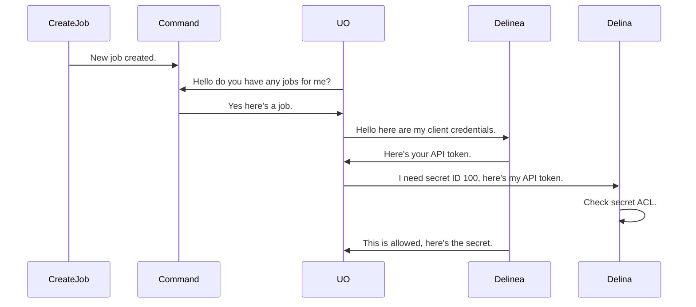
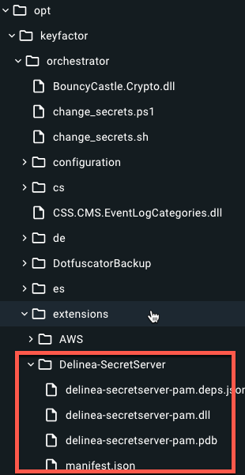
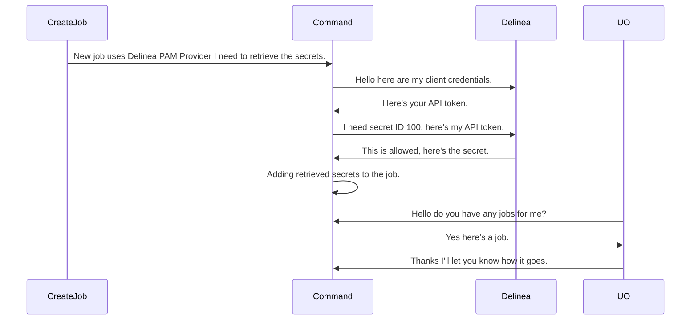
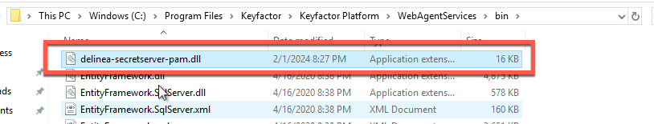
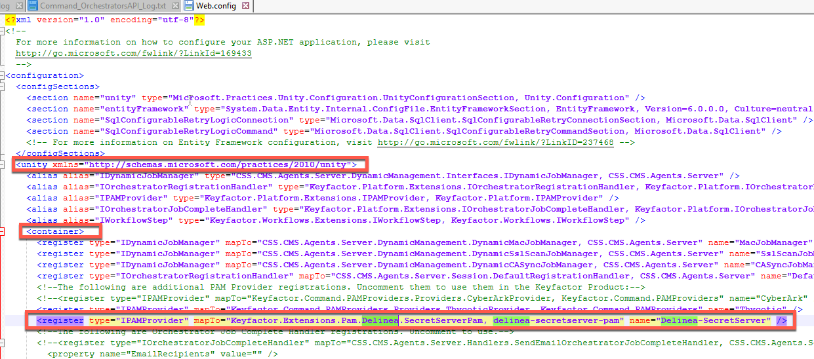

# Delinea Secret Server PAM Provider

The Delinea Secret Server PAM Provider allows for the retrieval of stored account credentials from a Delinea Secret 
Server secret. A valid username, password and secret share settings are required.

#### Integration status: Production - Ready for use in production environments.


## About the Keyfactor Command PAM Provider

Keyfactor supports the retrieval of credentials from 3rd party Privileged Access Management (PAM) solutions. Secret 
values can normally be stored, encrypted at rest, in the Keyfactor Platform database. A PAM Provider can allow these 
secrets to be stored, managed, and rotated in an external platform. This integration is usually configured on the 
Keyfactor Command Platform itself, where the platform can request the credential values when needed. In certain scenarios, 
a PAM Provider can instead be run on a remote location in conjunction with a Keyfactor Orchestrator to allow credential 
requests to originate from a location other than the Keyfactor Command Platform.


## Support for Delinea Secret Server PAM Provider

Delinea Secret Server PAM Provider is supported by Keyfactor for Keyfactor customers. If you have a support issue, please open a support ticket with your Keyfactor representative.

____To report a problem or suggest a new feature, use the **[Issues](../../issues)** tab. If you want to contribute actual bug fixes or proposed enhancements, use the **[Pull requests](../../pulls)** tab.____

---
- [Delinea Secret Server PAM Provider](#delinea-secret-server-pam-provider)
  - [Integration status: Production - Ready for use in production environments.](#integration-status--production---ready-for-use-in-production-environments)
    * [About the Keyfactor Command PAM Provider](#about-the-keyfactor-command-pam-provider)
    * [Support for Delinea Secret Server PAM Provider](#support-for-delinea-secret-server-pam-provider)
    * [Keyfactor Command Versions Supported](#keyfactor-command-versions-supported)
        + [Initial Configuration of PAM Provider](#initial-configuration-of-pam-provider)
        + [Configuring Parameters](#configuring-parameters)
        + [Initialization Parameters for each defined PAM Provider instance](#initialization-parameters-for-each-defined-pam-provider-instance)
        + [Instance Parameters for each retrieved secret field](#instance-parameters-for-each-retrieved-secret-field)
    * [Configuring for PAM Usage](#configuring-for-pam-usage)
        + [Delinea Secret Server](#delinea-secret-server)
        + [Install PAM provider on Keyfactor Universal Orchestrator (UO)](#install-pam-provider-on-keyfactor-universal-orchestrator--uo-)
            - [Installation](#installation)
            - [Step 1: Download the release and install the extension](#step-1--download-the-release-and-install-the-extension)
            - [Step 2: Create or update the manifest.json file in the Delinea-SecretServer folder](#step-2--create-or-update-the-manifestjson-file-in-the-delinea-secretserver-folder)
            - [Step 3: Restart the UO](#step-3--restart-the-uo)
            - [Step 4: Usage](#step-4--usage)
            - [Troubleshooting](#troubleshooting)
        + [Install PAM provider on Keyfactor Command Host](#install-pam-provider-on-keyfactor-command-host)
            - [Installation](#installation-1)
            - [Step 1: Create the PAM provider type in Keyfactor Command](#step-1--create-the-pam-provider-type-in-keyfactor-command)
            - [Step 2: Download the release and install the extension](#step-2--download-the-release-and-install-the-extension)
                * [Example DLL Install](#example-dll-install)
                * [Example Unity Entry](#example-unity-entry)
            - [Step 3: Restart the Keyfactor Command Service](#step-3--restart-the-keyfactor-command-service)
            - [Step 4: Create an instance of the PAM Provider in the Keyfactor Command Platform](#step-4--create-an-instance-of-the-pam-provider-in-the-keyfactor-command-platform)
            - [Step 5: Usage](#step-5--usage)
            - [Troubleshooting](#troubleshooting-1)

## Keyfactor Command Versions Supported

The minimum version of the Keyfactor Universal Orchestrator Framework needed to run this version of the extension is 10.1

| Keyfactor Version | Universal Orchestrator Framework Version | Supported    |
|-------------------|------------------------------------------|--------------|
| 10.4.5            | 10.1, 10.2, 10.4                         | &check;      |
| 10.4.0            | 10.1, 10.2, 10.4                         | &check;      |
| 10.2.1            | 10.1, 10.2, 10.4                         | &check;      |
| 10.1.1            | 10.1, 10.2,                              | &check;      |
| 10.0.0            | 10.1, 10.2                               | &check;      |
| 9.10.1            | Not supported on KF 9.X.X                | x            |
| 9.5.0             | Not supported on KF 9.X.X                | x            |

### Initial Configuration of PAM Provider
In order to allow Keyfactor to use the new Delinea Secret Server PAM Provider, the definition needs to be added to the 
application database. This is done by running the provided `kfutil` tool to install the PAM definition, which only 
needs to be done one time. It uses API credentials to access the Keyfactor instance and create the PAM definition.

The `kfutil` tool, after being [configured for API access](https://github.com/Keyfactor/kfutil#quickstart), can be run 
in the following manner to install the PAM definition from the Keyfactor repository:

```
kfutil pam types-create -r delinea-secretserver-pam -n Delinea-SecretServer
```

### Configuring Parameters
The following are the parameter names and a description of the values needed to configure the Delinea Secret Server PAM 
Provider.

### Initialization Parameters for each defined PAM Provider instance
| Initialization parameter |      Display Name      | Description                                                                                                                                                                                                      |
|:------------------------:|:----------------------:|------------------------------------------------------------------------------------------------------------------------------------------------------------------------------------------------------------------|
|           Host           |   Secret Server URL    | The IP address or URL of the Vault instance, including any port number                                                                                                                                           |
|         Username         | Secret Server Username | The username the PAM provider is going to use to connect to SecretServer.                                                                                                                                        |
|         Password         | Secret Server Password | The username the PAM provider is going to use to connect to SecretServer.                                                                                                                                        |
|        LogSecrets        |      Log Secrets       | Boolean value that determines if secret values are written to logs in plain text. Defaults to `false`. WARNING: There are security risks with writing secrets to logs, this should not be enabled in production! |


### Instance Parameters for each retrieved secret field
| Instance parameter |       Display Name       | Description                                                            |
|:------------------:|:------------------------:|------------------------------------------------------------------------|
|      SecretId      | Secret Server Secret ID  | The integer ID of the secret to use.                                   |
|  SecretFieldName   |    Secret Field Name     | The name of the field to use when looking up a secret on SecretServer. |


## Configuring for PAM Usage
### Delinea Secret Server
When configuring the Delinea Secret Server for use as a PAM Provider with Keyfactor, you will need to ensure that your
instance is configured for API access. This can be done by logging into the Delinea Secret Server as an administrator.
For more details visit the vendor docs [here](https://docs.delinea.com/secrets/current/api-scripting/sdk-cli/index.md#setup_procedure).

Once API access is configured a user account with a username and password is required. That account *MUST* be granted access
to view secret's you'll be using.

After adding and sharing a secret on SecretServer, you can use the secret's ID (the "Secret ID") and the desired value's
field name (the "Secret Field Name") to retrieve credentials from the Delinea Secret Server as a PAM Provider.

### Install PAM provider on Keyfactor Universal Orchestrator (UO)
When installing on the Universal Orchestrator, the PAM Provider is installed as a DLL and configured in the UO. This allows
the UO to use the PAM provider from the UO host/network and retrieve secrets from Delinea Secret Server and pass them
into Orchestrator extensions.



#### Installation
For full UO installation instructions please review the latest product documentation:
- [Windows](https://software.keyfactor.com/Content/InstallingAgents/NetCoreOrchestrator/InstalltheOrchestratorWindows.htm?Highlight=universal%20orchestrator)
- [Linux](https://software.keyfactor.com/Content/InstallingAgents/NetCoreOrchestrator/InstalltheOrchestratorLinux.htm)
- [Container](https://software.keyfactor.com/Content/InstallingAgents/NetCoreOrchestrator/InstalltheOrchestratorLinuxContainer.htm)

#### Step 1: Download the release and install the extension
For latest product documentation on installing orchestrator extensions please review the
[Keyfactor Universal Orchestrator Docs](https://software.keyfactor.com/Content/InstallingAgents/NetCoreOrchestrator/CustomExtensions.htm).

On the Universal Orchestrator host, locate the extensions directory within the install directory. By default, this is:
- Windows: `C:\Program Files\Keyfactor\Keyfactor Orchestrator\extensions`
- Linux: `/opt/keyfactor/orchestrator/extensions`

Then create a new folder named `Delinea-SecretServer` and copy the release contents into this folder. The directory structure
should look like the following:  



#### Step 2: Create or update the manifest.json file in the Delinea-SecretServer folder
This file is used by the UO to communicate with the PAM Provider's API. The `manifest.json` file should be located in the
`Delinea-SecretServer` folder. The `manifest.json` file should look like the following:
```json
{
  "extensions": {
    "Keyfactor.Platform.Extensions.IPAMProvider": {
      "PAMProviders.Delinea.PAMProvider": {
        "assemblyPath": "delinea-secretserver-pam.dll",
        "TypeFullName": "Keyfactor.Extensions.Pam.Delinea.SecretServerPam"
      }
    }
  },
  "Keyfactor:PAMProviders:Delinea-SecretServer:InitializationInfo": {
    "Host": "https://example.secretservercloud.com/SecretServer",
    "Username": "my_secretserver_service_account",
    "Password": "xxxxxx"
  }
}
```

#### Step 3: Restart the UO
Restart the UO service to load the new extension.

#### Step 4: Usage
After the extension is installed, you can use the PAM Provider when configuring certificate stores. In order to use the PAM
provider from the UO you'll need to use a JSON blob in the Server Password field. The JSON blob should look like the following:
```json
{
  "SecretId": 123,
  "SecretFieldName": "password"
}
```
The `SecretId` is the ID of the secret you want to retrieve from the Delinea Secret Server. The `SecretFieldName` is the
name of the field in the secret you want to retrieve and use as the password value.


#### Troubleshooting
If you are having trouble with the PAM Provider, you can review the UO logs for errors by searching for `Delinea`. Please
review the latest product documentation for [configuring logging](https://software.keyfactor.com/Content/InstallingAgents/NetCoreOrchestrator/ConfigureLogging.htm)


### Install PAM provider on Keyfactor Command Host
When installing on Keyfactor Command, the PAM Provider is installed as a DLL and configured in the Keyfactor Platform.
This allows the Keyfactor Command Platform to use the PAM provider and retrieve secrets from the Delinea Secret Server
and pass them down to a Universal Orchestrator.



#### Installation
For latest product documentation on installing a PAM provider on a Keyfactor Command Server please review the [Keyfactor Command Docs](https://software.keyfactor.com/Content/ReferenceGuide/Preparing%20Third%20Party%20PAM%20Providers%20to%20Work%20with.htm?Highlight=pam).
Specifically the section labeled `Installation on the Keyfactor Command Server`

#### Step 1: Create the PAM provider type in Keyfactor Command
In order to allow Keyfactor Command to use the new Delinea Secret Server PAM provider, the definition needs to be added
to the application database. This is done by running the provided `kfutil` tool to install the PAM definition, which only
needs to be done one time. It uses API credentials to access the Keyfactor instance and create the PAM definition.

The `kfutil` tool, after being [configured for API access](https://github.com/Keyfactor/kfutil#quickstart), can be run
in the following manner to install the PAM definition from the Keyfactor repository:

```
kfutil pam types-create -r delinea-secretserver-pam -n Delinea-SecretServer
```

**Alternatively** you can also use the Keyfactor Command API directly, please review the product documentation above.

#### Step 2: Download the release and install the extension
After the installation is run, the DLLs need to be installed to the correct location for the PAM Provider to function.
From the release, the `delinea-secretserver-pam.dll` should be copied to the following folder locations in the Keyfactor
Command installation. Once the DLL has been copied to these folders, edit the corresponding config file. You will need to add a
new Unity entry as follows under `<container>`, next to other `<register>` tags.

Default Keyfactor Command Install Path:
- Windows: `C:\Program Files\Keyfactor\`

| Install Location | DLL Binary Folder     | Config File                         |
|------------------|-----------------------|-------------------------------------|
| WebAgentServices | WebAgentServices\bin\ | WebAgentServices\web.config         |
| Service          | Service\              | Service\CMSTimerService.exe.config  |
| KeyfactorAPI     | KeyfactorAPI\bin\     | KeyfactorAPI\web.config             |
| WebConsole       | WebConsole\bin\       | WebConsole\web.config               |

##### Example DLL Install



##### Example Unity Entry
```xml
<register type="IPAMProvider" mapTo="Keyfactor.Extensions.Pam.Delinea.SecretServerPam, delinea-secretserver-pam" name="Delinea-SecretServer" />
```
]
]

#### Step 3: Restart the Keyfactor Command Service
The Keyfactor Command service and IIS Server should be restarted after making these changes.

#### Step 4: Create an instance of the PAM Provider in the Keyfactor Command Platform
For full details and the latest product documentation on creating a PAM Provider instance please review the
[PAM Provider Configuration in Keyfactor Command](https://software.keyfactor.com/Content/ReferenceGuide/PAM%20Configuration%20in%20Keyfactor%20Command.htm?Highlight=delinea) docs.

In order to use the PAM Provider, the provider's configuration must be set in the Keyfactor Platform. In the settings
menu (upper right cog) you can select the ___Priviledged Access Management___ option to configure your provider instance.


#### Step 5: Usage
After an instance of the PAM provider is created, you can now use your PAM Provider when configuring certificate stores.
Any field that is treated as a Keyfactor Command secret, such as `Server Password`s and certificate `Store Password`s can
be retrieved from your PAM Provider instead of being entered in directly as a secret.


#### Troubleshooting
If you are having trouble with the PAM Provider, you can review the Keyfactor Command logs for errors by searching for `Delinea`.
Please review the latest product documentation for [configuring logging](https://software.keyfactor.com/Content/ReferenceGuide/Log%20Edit.htm)
on the Keyfactor Command Server.
```