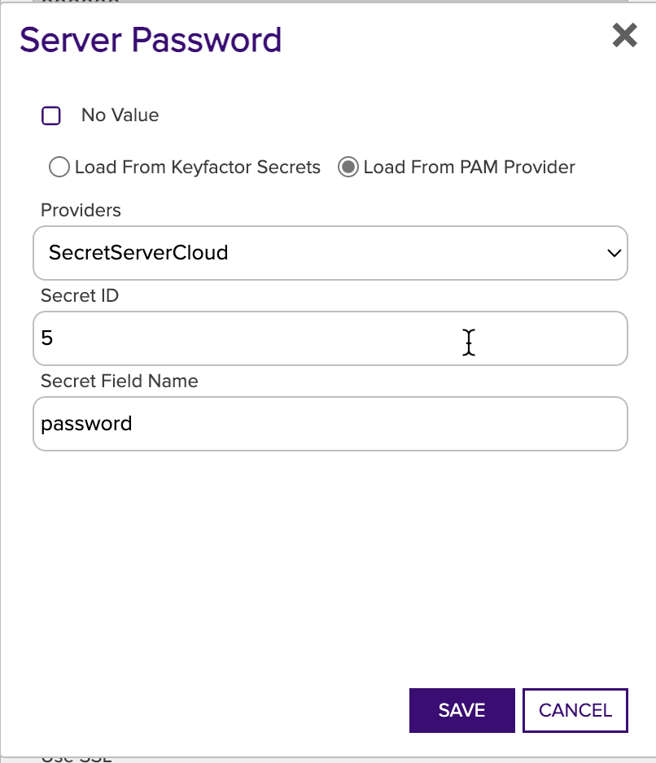

# Delinea Secret Server PAM Provider

The Delinea Secret Server PAM Provider allows for the retrieval of stored account credentials from a Delinea Secret Server secret. A valid username, password and secret share settings are required.

#### Integration status: Production - Ready for use in production environments.


## About the Keyfactor PAM Provider

Keyfactor supports the retrieval of credentials from 3rd party Privileged Access Management (PAM) solutions. Secret values can normally be stored, encrypted at rest, in the Keyfactor Platform database. A PAM Provider can allow these secrets to be stored, managed, and rotated in an external platform. This integration is usually configured on the Keyfactor Platform itself, where the platform can request the credential values when needed. In certain scenarios, a PAM Provider can instead be run on a remote location in conjunction with a Keyfactor Orchestrator to allow credential requests to originate from a location other than the Keyfactor Platform.


## Support for Delinea Secret Server PAM Provider

Delinea Secret Server PAM Provider is supported by Keyfactor for Keyfactor customers. If you have a support issue, please open a support ticket with your Keyfactor representative.

###### To report a problem or suggest a new feature, use the **[Issues](../../issues)** tab. If you want to contribute actual bug fixes or proposed enhancements, use the **[Pull requests](../../pulls)** tab.


---


### Initial Configuration of PAM Provider
In order to allow Keyfactor to use the new Delinea Secret Server PAM Provider, the definition needs to be added to the application database.
This is done by running the provided `kfutil` tool to install the PAM definition, which only needs to be done one time. It uses API credentials to access the Keyfactor instance and create the PAM definition.

The `kfutil` tool, after being [configured for API access](https://github.com/Keyfactor/kfutil#quickstart), can be run in the following manner to install the PAM definition from the Keyfactor repository:

```
kfutil pam types-create -r delinea-secretserver-pam -n Delinea-SecretServer
```

### Configuring Parameters
The following are the parameter names and a description of the values needed to configure the Delinea Secret Server PAM Provider.

### Initialization Parameters for each defined PAM Provider instance
| Initialization parameter |      Display Name       | Description                                                               |
|:------------------------:|:-----------------------:|---------------------------------------------------------------------------|
|           Host           |    Secret Server URL    | The IP address or URL of the Vault instance, including any port number    |
|         Username         | Secret Server Username  | The username the PAM provider is going to use to connect to SecretServer. |
|         Password         | Secret Server Password  | The username the PAM provider is going to use to connect to SecretServer. |


### Instance Parameters for each retrieved secret field
| Instance parameter |       Display Name       | Description                                                            |
|:------------------:|:------------------------:|------------------------------------------------------------------------|
|      SecretId      | Secret Server Secret ID  | The integer ID of the secret to use.                                   |
|  SecretFieldName   |    Secret Field Name     | The name of the field to use when looking up a secret on SecretServer. |


## Configuring for PAM Usage
### Delinea Secret Server
When configuring the Delinea Secret Server for use as a PAM Provider with Keyfactor, you will need to ensure that your 
instance is configured for API access. This can be done by logging into the Delinea Secret Server as an administrator.
For more details visit the vendor docs [here](https://docs.delinea.com/secrets/current/api-scripting/sdk-cli/index.md#setup_procedure).

Once API access is configured a user account with a username and password is required. That account *MUST* be granted access 
to view secret's you'll be using. 

After adding and sharing a secret on SecretServer, you can use the secret's ID (the "Secret ID") and the desired value's 
field name (the "Secret Field Name") to retrieve credentials from the Delinea Secret Server as a PAM Provider.

#### In Keyfactor - PAM Provider
##### Installation
In order to setup a new PAM Provider in the Keyfactor Platform for the first time, you will need to run the `kfutil` tool (see Initial Configuration of PAM Provider).

After the installation is run, the DLLs need to be installed to the correct location for the PAM Provider to function. From the release, the delinea-secretserver-pam.dll should be copied to the following folder locations in the Keyfactor installation. Once the DLL has been copied to these folders, edit the corresponding config file. You will need to add a new Unity entry as follows under `<container>`, next to other `<register>` tags.

| Install Location | DLL Binary Folder | Config File |
| --- | --- | --- |
| WebAgentServices | WebAgentServices\bin\ | WebAgentServices\web.config |
| Service | Service\ | Service\CMSTimerService.exe.config |
| KeyfactorAPI | KeyfactorAPI\bin\ | KeyfactorAPI\web.config |
| WebConsole | WebConsole\bin\ | WebConsole\web.config |

When enabling a PAM provider for Orchestrators only, the first line for `WebAgentServices` is the only installation needed.

The Keyfactor service and IIS Server should be restarted after making these changes.

```xml
<register type="IPAMProvider" mapTo="Keyfactor.Extensions.Pam.Delinea.SecretServerPam, delinea-secretserver-pam" name="Delinea-SecretServer" />
```


##### Usage
In order to use the PAM Provider, the provider's configuration must be set in the Keyfactor Platform. In the settings menu (upper right cog) you can select the ___Priviledged Access Management___ option to configure your provider instance.


After it is set up, you can now use your PAM Provider when configuring certificate stores. Any field that is treated as a Keyfactor secret, such as server passwords and certificate store passwords can be retrieved from your PAM Provider instead of being entered in directly as a secret.




---


- [Delinea Secret Server PAM Provider](#delinea-secret-server-pam-provider)
    * [Integration status: Pilot - Not for use in production environments.](#integration-status--pilot---not-for-use-in-production-environments)
    * [About the Keyfactor PAM Provider](#about-the-keyfactor-pam-provider)
    * [Support for Delinea Secret Server PAM Provider](#support-for-delinea-secret-server-pam-provider)
    * [Keyfactor Version Supported](#keyfactor-version-supported)
    * [Initial Configuration of PAM Provider](#initial-configuration-of-pam-provider)
    * [Configuring Parameters](#configuring-parameters)
        + [Initialization Parameters for each defined PAM Provider instance](#initialization-parameters-for-each-defined-pam-provider-instance)
        + [Instance Parameters for each retrieved secret field](#instance-parameters-for-each-retrieved-secret-field)
    * [Configuring for PAM Usage](#configuring-for-pam-usage)
        + [Delinea Secret Server](#delinea-secret-server)
        + [Keyfactor Universal Orchestrator](#keyfactor-universal-orchestrator)
            - [Installation](#installation)
            - [Usage](#usage)
        + [Keyfactor Command - PAM Provider](#keyfactor-command---pam-provider)
            - [Installation](#installation-1)
            - [Usage](#usage-1)

## Keyfactor Version Supported

The minimum version of the Keyfactor Universal Orchestrator Framework needed to run this version of the extension is 10.1

| Keyfactor Version | Universal Orchestrator Framework Version | Supported    |
|-------------------|------------------------------------------|--------------|
| 10.2.1            | 10.1, 10.2                               | &check;      |
| 10.1.1            | 10.1, 10.2                               | &check;      |
| 10.0.0            | 10.1, 10.2                               | &check;      |
| 9.10.1            | Not supported on KF 9.X.X                | x            |
| 9.5.0             | Not supported on KF 9.X.X                | x            |

## Initial Configuration of PAM Provider
In order to allow Keyfactor to use the new Delinea Secret Server PAM Provider, the definition needs to be added to the 
application database. This is done by running the provided `kfutil` tool to install the PAM definition, which only needs
to be done one time. It uses API credentials to access the Keyfactor instance and create the PAM definition.

The `kfutil` tool, after being [configured for API access](https://github.com/Keyfactor/kfutil#quickstart), can be run in the following manner to install the PAM definition from the Keyfactor repository:

```
kfutil pam types-create -r delinea-secretserver-pam -n Delinea-SecretServer
```

## Configuring Parameters
The following are the parameter names and a description of the values needed to configure the Delinea Secret Server PAM Provider.


### Keyfactor Universal Orchestrator
#### Installation
Configuring the UO to use the Delinea Secret Server PAM Provider requires first installing it as an extension by copying 
the release contents into a new extension folder named `Delinea-SecretServer`. A `manifest.json` file is included in the 
release. This file needs to be edited to enter in the "initialization" parameters for the PAM Provider. Specifically 
values need to be entered for the parameters in the `manifest.json` of the __PAM Provider extension__:

~~~ json
"Keyfactor:PAMProviders:Delinea-SecretServer:InitializationInfo": {
    "Host": "https://example.secretservercloud.com",
    "Username": "my_secretserver_service_account",
    "Password": "xxxxxx"
  }
~~~

#### Usage
To use the PAM Provider to resolve a field, for example a Server Password, instead of entering in the actual value for 
the Server Password, enter a `json` object with the parameters specifying the field. The parameters needed are the 
"instance" parameters above:

~~~ json
{"SecretId":"1","SecretFieldName":"password"}
~~~

If a field supports PAM but should not use PAM, simply enter in the actual value to be used instead of the `json` format 
object above.

### Keyfactor Command - PAM Provider
#### Installation
In order to setup a new PAM Provider in the Keyfactor Platform for the first time, you will need to run the `kfutil` 
tool [see Initial Configuration of PAM Provider](#initial-configuration-of-pam-provider).

After the installation is run, the DLLs need to be installed to the correct location for the PAM Provider to function. 
From the release, the delinea-secretserver-pam.dll should be copied to the following folder locations in the Keyfactor 
installation. Once the DLL has been copied to these folders, edit the corresponding config file. You will need to add a 
new Unity entry as follows under `<container>`, next to other `<register>` tags.

| Install Location   | DLL Binary Folder       | Config File                        |
|--------------------|-------------------------|------------------------------------|
| WebAgentServices   | WebAgentServices\bin\   | WebAgentServices\web.config        |
| Service            | Service\                | Service\CMSTimerService.exe.config |
| KeyfactorAPI       | KeyfactorAPI\bin\       | KeyfactorAPI\web.config            |
| WebConsole         | WebConsole\bin\         | WebConsole\web.config              |

When enabling a PAM provider for Orchestrators only, the first line for `WebAgentServices` is the only installation needed.

The Keyfactor service and IIS Server should be restarted after making these changes.

```xml
<register type="IPAMProvider" mapTo="Keyfactor.Extensions.Pam.Delinea.SecretServerPam, delinea-secretserver-pam" name="Delinea-SecretServer" />
```

#### Usage
In order to use the PAM Provider, the provider's configuration must be set in the Keyfactor Platform. In the settings 
menu (upper right cog) you can select the ___Privileged Access Management___ option to configure your provider instance.


After it is set up, you can now use your PAM Provider when configuring certificate stores. Any field that is treated as 
a Keyfactor secret, such as server passwords and certificate store passwords can be retrieved from your PAM Provider 
instead of being entered in directly as a secret.


---


