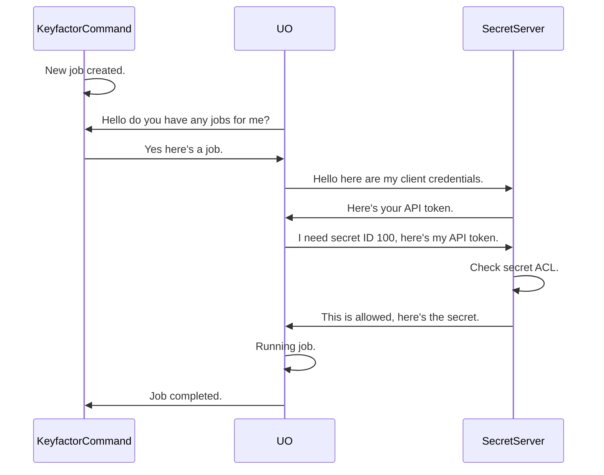
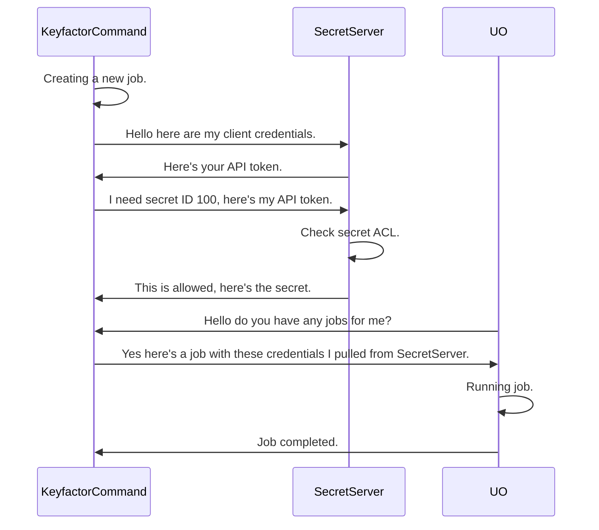

## Overview

The Delinea Secret Server PAM Provider allows for the retrieval of stored account credentials from a Delinea Secret
Server secret. Supports either `password` or `client_credential` authentication methods. For more information on
these authentication methods, see the 
[Delinea Secret Server documentation](https://docs.delinea.com/online-help/secret-server/api-scripting/authentication/script-token-auth/index.htm).

## Requirements

- Delinea Secret Server service account or client credential w/ permission to access the secret(s) being used

## Extension Mechanics

When configuring the Delinea Secret Server for use as a PAM Provider with Keyfactor, you will need to ensure that your
instance is configured for API access. This can be done by logging into the Delinea Secret Server as an administrator.
For more details visit the vendor docs [here](https://docs.delinea.com/online-help/secret-server/api-scripting/sdk-devops/using-sdk/index.htm#SetupProcedure).

Once API access is configured a user account with a username and password is required. That account *MUST* be granted access
to view secret's you'll be using.

After adding and sharing a secret on SecretServer, you can use the secret's ID (the "Secret ID") and the desired value's
field name (the "Secret Field Name") to retrieve credentials from the Delinea Secret Server as a PAM Provider.

### Running the PAM provider on Keyfactor Universal Orchestrator (UO)
When installing on the Universal Orchestrator (UO), is installed on and run from the UO host. Below is a sequence diagram
showing the flow of the PAM provider when it is run from the UO.

### Running the PAM provider on the Keyfactor Command Host
When installing the PAM provider on the Keyfactor Command Host, is installed on and run from the Keyfactor Command host.
Below is a sequence diagram showing the flow of the PAM provider when it is run from the Keyfactor Command Host.

